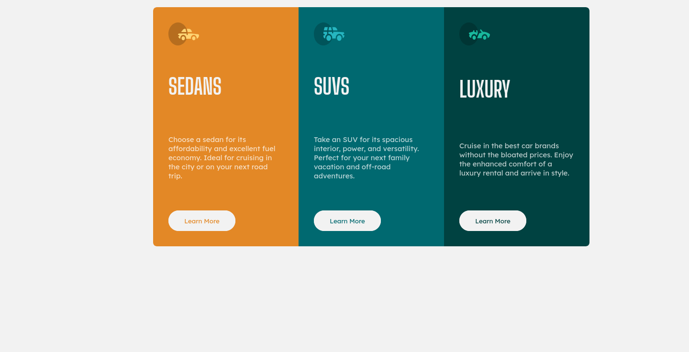

# Frontend Mentor - 3-column preview card component solution Español

Esta es una solución para el [3-column preview card component challenge on Frontend Mentor](https://www.frontendmentor.io/challenges/3column-preview-card-component-pH92eAR2-). Los retos de Frontend Mentor pueden ayudarte a mejorar tus habilidades por medio de crear proyectos reales.

## Tabla de contenidos
- [Información general](#información-general)
  - [El reto](#el-reto)
  - [Screenshot](#screenshot)
  - [Links](#links)
- [Mi proceso](#mi-proceso)
  - [Herramientas utilizadas](#herramientas-utilizadas)
  - [Lo que aprendí](#lo-que-aprendí)
- [Autor](#autor)

## Información general

### El reto

Los usuarios deberán ser capaces de:

- Ver la disposición correcta dependiendo del tamaño de la pantalla de su dispositivo.
- Ver los estados de hover para los elementos interactivos

### Screenshot

### Versión de telefono

### Tamaño personalizado de la pantalla del telefono 

### Versión de escritorio

### Versión de escritorio con los estados

### Tamaño personalizado de la pantalla de la computadora

### Links

- URL para probar el sitio: [Github pages](https://caresle.github.io/stats-preview-card-component/)

## Mi proceso

### Herramientas utilizadas

- HTML5
- CSS custom properties
- Flexbox
- CSS Grid
- Mobile-first workflow

### Lo que aprendí

Entender mejor la propiedad flex-direction.

## Autor

- Frontend Mentor - [@Caresle](https://www.frontendmentor.io/profile/Caresle)
- Instagram - [@caresle1](https://instagram.com/caresle1)